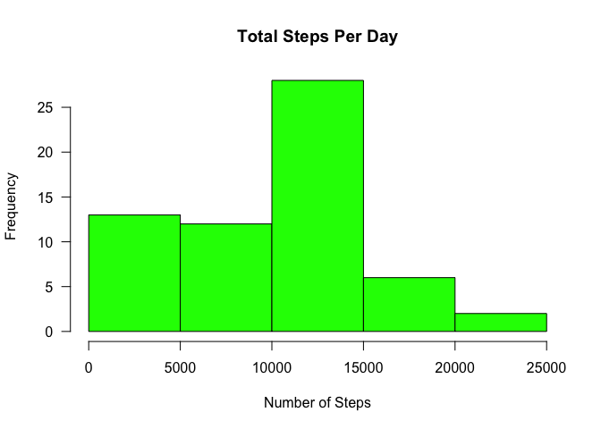

##Loading and preprocessing the data

```r
library(lubridate)
```

```
## Warning: package 'lubridate' was built under R version 3.4.3
```

```
## 
## Attaching package: 'lubridate'
```

```
## The following object is masked from 'package:base':
## 
##     date
```

```r
library(dplyr)
```

```
## Warning: package 'dplyr' was built under R version 3.4.2
```

```
## 
## Attaching package: 'dplyr'
```

```
## The following objects are masked from 'package:lubridate':
## 
##     intersect, setdiff, union
```

```
## The following objects are masked from 'package:stats':
## 
##     filter, lag
```

```
## The following objects are masked from 'package:base':
## 
##     intersect, setdiff, setequal, union
```

```r
unzip("activity.zip", exdir = "data")

activity <- read.csv("data/activity.csv", stringsAsFactors=FALSE)
```

## What is mean total number of steps taken per day?

```r
total_steps_per_day <- activity %>% group_by(date) %>% summarize(total_steps=sum(steps,na.rm=TRUE),na=mean(is.na(steps))) %>% print
```

```
## # A tibble: 61 x 3
##          date total_steps    na
##         <chr>       <int> <dbl>
##  1 2012-10-01           0     1
##  2 2012-10-02         126     0
##  3 2012-10-03       11352     0
##  4 2012-10-04       12116     0
##  5 2012-10-05       13294     0
##  6 2012-10-06       15420     0
##  7 2012-10-07       11015     0
##  8 2012-10-08           0     1
##  9 2012-10-09       12811     0
## 10 2012-10-10        9900     0
## # ... with 51 more rows
```

```r
##Make a histogram of the total number of steps taken each day
hist(total_steps_per_day$total_steps, main="Total Steps Per Day", xlab="Number of Steps", border="black", col="green",las=1,breaks=5)
```

<!-- -->

```r
##Calculate and report the mean and median of the total number of steps taken per day
mean_steps_per_day <- mean(total_steps_per_day$total_steps,na.rm=TRUE) %>% print
```

```
## [1] 9354.23
```

```r
median_steps_per_day <- median(total_steps_per_day$total_steps,na.rm=TRUE) %>% print
```

```
## [1] 10395
```

## What is the average daily activity pattern?

```r
library(dplyr)
## Time series plot for the 5 minute interval averaged across all days
daily_pattern <- activity %>% group_by(interval) %>% summarize(avg=mean(steps,na.rm=TRUE))
plot(x = 1:nrow(daily_pattern),y = daily_pattern$avg,type = "l",
     col = "blue", xaxt = "n",xlab="Intervals", 
     ylab = "Average for 5 minute interval for all days")
axis(1,labels=daily_pattern$interval[seq(1,288,12)], at = seq_along(daily_pattern$interval)[seq(1,288,12)])
```

<!-- -->

```r
##Which 5 minute interval across all days on average has the maximum number of steps
max_5Min_step_interval <- filter(daily_pattern,avg==max(avg)) %>% print
```

```
## # A tibble: 1 x 2
##   interval      avg
##      <int>    <dbl>
## 1      835 206.1698
```
## Imputing missing values

```r
##1. Calculate and report the total number of missing values in the dataset (i.e. the total number of rows with NAs)
missing_value_cnt <- sum(is.na(activity$steps)) %>% print
```

```
## [1] 2304
```

```r
##2. Devise a strategy for filling in all of the missing values in the dataset
missing_value_rep <- mean(is.na(activity$steps)) %>% print
```

```
## [1] 0.1311475
```

```r
##3. Create a new dataset that is equal to the original dataset but with the missing data filled in.
decode_na <- numeric(nrow(activity))
for (x in 1:nrow(activity))
{
        if (is.na(activity[x,"steps"])==TRUE)
            {
                    decode_na[x]<-filter(daily_pattern,interval==activity[x,"interval"]) %>% select(avg)
            } 
        else
            {
                    decode_na[x]<-activity[x,"steps"]
            }
                    
}
activity_with_imputed_na<-mutate(activity,steps_imputed_na=as.integer(decode_na))
head(activity_with_imputed_na)
```

```
##   steps       date interval steps_imputed_na
## 1    NA 2012-10-01        0                1
## 2    NA 2012-10-01        5                0
## 3    NA 2012-10-01       10                0
## 4    NA 2012-10-01       15                0
## 5    NA 2012-10-01       20                0
## 6    NA 2012-10-01       25                2
```

```r
##4
##hist(activity$steps)
##hist(activity_with_imputed_na$steps_imputed_na)
hist(activity_with_imputed_na$steps_imputed_na, border="black", col="green",las=1,breaks=5)
```

<!-- -->

```r
total_day_imputed_na <- activity_with_imputed_na %>% mutate(steps_imputed_na=as.numeric(steps_imputed_na)) %>% group_by(date) %>% summarize(total_steps=sum(steps_imputed_na))
hist(total_day_imputed_na$total_steps,col="red",breaks=20,main="Total steps per day",xlab="Steps per day")
abline(v=median(total_steps_per_day$total_steps),lty=3, lwd=2, col="black")
legend(legend="median","topright",lty=3,lwd=2,bty = "n")
```

<!-- -->

```r
mean(total_day_imputed_na$total_steps)
```

```
## [1] 10749.77
```

```r
median(total_day_imputed_na$total_steps)
```

```
## [1] 10641
```
The mean value increased by 1395.  The median increased by 246.  

## Are there differences in activity patterns between weekdays and weekends?


```r
##Identify Weekends vs Weekday
library(lubridate)
is_weekend <-function(date){
    if(wday(date)%in%c(2,3,4,5,6)) result<-"weekday"
    else
      result<-"weekend"
      result
}
activity_with_imputed_na <- mutate(activity_with_imputed_na,date=ymd(date)) %>% mutate(day=sapply(date,is_weekend)) 
table(activity_with_imputed_na$day)
```

```
## 
## weekday weekend 
##   12960    4608
```

```r
##Plot Weekend vs Weekday
library(ggplot2)
daily_pattern <- activity_with_imputed_na %>% mutate(dayType=factor(day,levels=c("weekend","weekday")),steps_imputed_na=as.numeric(steps_imputed_na)) %>% group_by(interval,dayType) %>% summarize(average=mean(steps_imputed_na))
qplot(interval,average,data=daily_pattern,geom="line",facets=dayType~.)
```

<!-- -->
